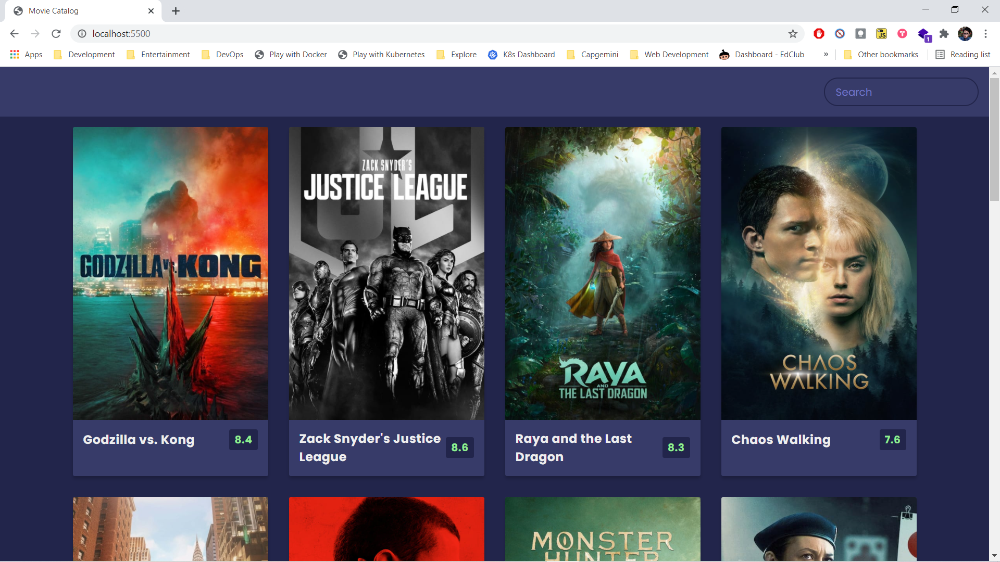
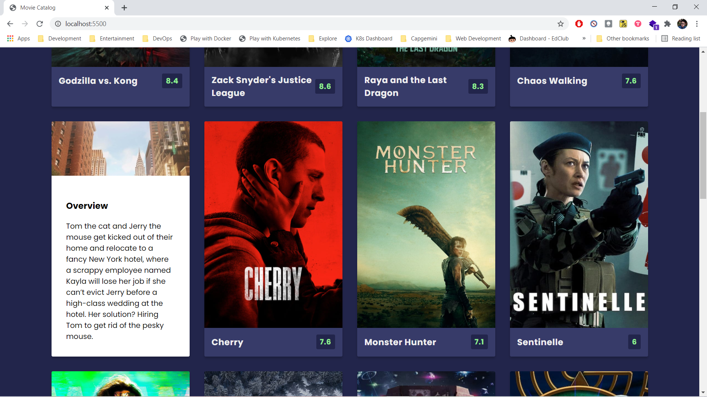

# Movie Catalog

- [Movie Catalog](#movie-catalog)
  - [Deployment](#deployment)
  - [Description](#description)
  - [Screenshots](#screenshots)

## Deployment

- Checkout deployment at <https://gagandeep39.github.io/css-movie-catalog>

## Description

- Simple HTML + CSS to view a movie Catalog
- Uses third party api https://www.themoviedb.org/documentation/api
- Uses Java script `fetch`

## Screenshots

